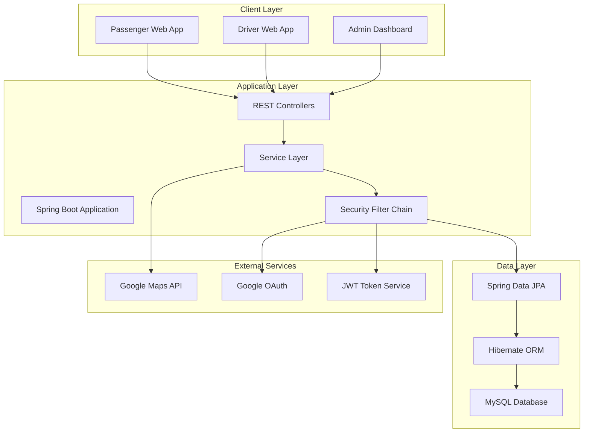

# 🚖 JustRide - Complete Taxi Booking System

A comprehensive web-based taxi booking platform built with **Java Spring Boot** and **MySQL** that seamlessly connects passengers, drivers, and administrators for efficient ride management.

[](https://www.oracle.com/java/)
[](https://spring.io/projects/spring-boot)
[](https://www.mysql.com/)
[](https://jwt.io/)
[](https://getbootstrap.com/)

## 📋 Table of Contents

- [🎯 Project Overview](#-project-overview)
- [✨ Key Features](#-key-features)
- [🛠 Technology Stack](#-technology-stack)
- [🏗 System Architecture](#-system-architecture)
- [🚀 Getting Started](#-getting-started)
- [📁 Project Structure](#-project-structure)
- [🔧 Configuration](#-configuration)
- [📱 User Interfaces](#-user-interfaces)
- [🔐 Security Features](#-security-features)
- [🧪 Testing](#-testing)
- [🚢 Deployment](#-deployment)
- [🤝 Contributing](#-contributing)
- [📄 License](#-license)

## 🎯 Project Overview

**JustRide** is a modern, full-stack taxi booking system designed to revolutionize urban transportation. The platform provides a seamless experience for three types of users: passengers seeking rides, drivers offering transportation services, and administrators managing the entire ecosystem.

### 🎯 Key Objectives

| Objective | Description |
|-----------|-------------|
| **🚀 Convenience** | Quick booking for passengers and easy ride management for drivers |
| **🔒 Safety & Security** | Verified drivers with secure JWT-based authentication |
| **📍 Real-time Updates** | Live ride tracking and instant status notifications |
| **📊 Transparency** | Comprehensive admin dashboard with full system monitoring |
| **💰 Efficiency** | Automated fare calculation and payment processing |

### 👥 Target Users

- **🧑‍💼 Passengers**: Book taxis, track rides, and manage trip history
- **🚗 Drivers**: Accept rides, update availability, and track earnings
- **👨‍💻 Administrators**: Verify drivers, monitor system, and manage operations

## ✨ Key Features

### 🔹 Passenger Features

#### 🔐 Account Management
- **Multi-authentication Options**: Traditional email/password and Google OAuth integration
- **Profile Management**: Complete profile setup with progress tracking (40% completion indicator)
- **Secure Sessions**: JWT-based authentication with automatic token refresh
- **Account Security**: Password reset and profile verification systems

#### 🚕 Ride Booking & Management
- **Interactive Booking Interface**: Map-based pickup and drop-off location selection
- **Real-time Fare Calculation**: Dynamic pricing based on distance and vehicle type
- **Driver Matching**: Intelligent algorithm to match with nearest available drivers
- **Live Tracking**: GPS-based real-time ride tracking with ETA updates
- **Trip History**: Comprehensive ride history with detailed receipts and driver information

#### 📊 Dashboard Analytics
- **Statistics Overview**: Total rides completed, savings tracker, and loyalty rewards
- **Rating System**: Average rating display and feedback management
- **Booking Management**: Upcoming rides and trip scheduling functionality

### 🔹 Driver Features

#### 📋 Professional Onboarding
- **Document Verification System**: Upload driving license, vehicle registration, and insurance
- **Multi-step Approval Process**: Admin-reviewed verification with status tracking
- **Profile Completion Guide**: Step-by-step profile setup with completion percentage
- **Vehicle Registration**: Complete vehicle details and photo verification

#### 🚗 Ride Operations
- **Real-time Request Notifications**: Instant ride request alerts with passenger details
- **Smart Acceptance System**: Accept or decline rides with automatic timeout
- **Route Optimization**: GPS-based navigation with optimal route suggestions
- **Trip Management**: Start, update, and complete ride status in real-time
- **Passenger Communication**: In-app messaging and contact capabilities

#### 💰 Earnings & Performance
- **Earnings Dashboard**: Real-time earnings tracking with daily, weekly, and monthly summaries
- **Performance Metrics**: Total rides, average rating, and customer feedback analysis
- **Payment Management**: Automatic fare calculation and commission tracking
- **Time Analytics**: Average ride time and efficiency metrics

### 🔹 Admin Features

#### 👨‍💼 Driver Management
- **Verification Workflow**: Comprehensive driver approval system with document review
- **Background Checks**: Integration with verification services for safety compliance
- **Performance Monitoring**: Driver rating analysis and performance evaluation
- **Account Management**: Suspend, activate, or remove driver accounts

#### 🎛 System Administration
- **Financial Management**: 
  - Dynamic fare setting with base fare and per-kilometer rates
  - Commission structure configuration
  - Revenue tracking and financial reporting
- **Real-time Monitoring**: Live dashboard showing active rides, drivers, and system status
- **User Management**: Add new members, manage user accounts, and handle support requests
- **Analytics & Reporting**: Comprehensive system analytics with data visualization

#### 🔧 System Configuration
- **Fare Management**: Configure base fares, per-km rates, and surge pricing
- **Member Management**: Add and manage drivers, passengers, and admin accounts
- **System Settings**: Platform configuration and feature toggle management

## 🛠 Technology Stack

### Backend Architecture
| Component | Technology | Version | Purpose |
|-----------|------------|---------|---------|
| **Core Framework** | Spring Boot | 3.0+ | Main application framework and dependency injection |
| **Web Layer** | Spring MVC | 6.0+ | RESTful API development and request handling |
| **Security** | Spring Security | 6.0+ | Authentication, authorization, and security |
| **Data Access** | Spring Data JPA | 3.0+ | Database operations and repository management |
| **ORM** | Hibernate | 6.1+ | Object-relational mapping and database interactions |
| **Database** | MySQL | 8.0+ | Primary data storage and management |
| **Authentication** | JWT | Latest | Stateless authentication and session management |
| **Build Tool** | Maven | 3.8+ | Dependency management and project building |

### Frontend Technology
| Component | Technology | Version | Purpose |
|-----------|------------|---------|---------|
| **Markup** | HTML5 | Latest | Semantic structure and content |
| **Styling** | CSS3 | Latest | Custom styling and animations |
| **Framework** | Bootstrap | 5.3+ | Responsive design and UI components |
| **Scripting** | JavaScript (ES6+) | Latest | Client-side interactions and dynamic behavior |
| **Maps Integration** | Google Maps API | v3 | Location services and route mapping |
| **HTTP Client** | Fetch API | Native | API communication and data exchange |

### Development Tools
- **IDE**: IntelliJ IDEA, Eclipse, or VS Code
- **Version Control**: Git with GitHub
- **Database Management**: MySQL Workbench or phpMyAdmin
- **API Testing**: Postman or Insomnia
- **Frontend Serving**: Live Server, Python HTTP Server, or Node.js

## 🏗 System Architecture

### Application Architecture



### Database Schema Overview

The JustRide system uses a well-structured relational database with the following key entities:

#### Core Entities
- **Users**: Stores all user types (passengers, drivers, admins) with role-based access
- **Rides**: Central entity for ride requests, bookings, and trip management
- **Vehicles**: Driver vehicle information and specifications
- **Locations**: GPS coordinates for pickups, drop-offs, and driver positions
- **Payments**: Financial transactions and fare calculations
- **Reviews**: Rating and feedback system for quality assurance

#### Relationships
- **One-to-Many**: User → Rides, Driver → Vehicles, Ride → Payments
- **Many-to-One**: Ride → Driver, Ride → Passenger, Payment → Ride
- **One-to-One**: Driver → Vehicle (primary), User → Profile

## 🚀 Getting Started

### Prerequisites

Ensure you have the following installed on your development machine:

| Requirement | Minimum Version | Recommended | Download Link |
|-------------|----------------|-------------|---------------|
| **Java JDK** | 17 | 21 LTS | [Oracle JDK](https://www.oracle.com/java/technologies/downloads/) |
| **Apache Maven** | 3.8.0 | 3.9+ | [Maven Download](https://maven.apache.org/download.cgi) |
| **MySQL Server** | 8.0 | 8.0+ | [MySQL Download](https://dev.mysql.com/downloads/mysql/) |
| **Git** | 2.30 | Latest | [Git Download](https://git-scm.com/downloads) |

### Installation Guide

#### Step 1: Clone the Repository

```bash
# Clone the JustRide repository
git clone https://github.com/Vihanga-Sathsara/JustRide.git

# Navigate to the project directory
cd JustRide

# List project contents
ls -la
```

#### Step 2: Database Setup

**Create MySQL Database:**
```sql
-- Connect to MySQL as root user
mysql -u root -p

-- Create the database
CREATE DATABASE justride CHARACTER SET utf8mb4 COLLATE utf8mb4_unicode_ci;

-- Create application user (optional but recommended)
CREATE USER 'justride_user'@'localhost' IDENTIFIED BY 'JustRide@2024!';

-- Grant privileges
GRANT ALL PRIVILEGES ON justride.* TO 'justride_user'@'localhost';
FLUSH PRIVILEGES;

-- Use the database
USE justride;

-- Exit MySQL
EXIT;
```

#### Step 3: Backend Configuration

**Configure Application Properties:**

Create or modify `src/main/resources/application.properties`:

```properties
# ===========================================
# DATABASE CONFIGURATION
# ===========================================
spring.datasource.url=jdbc:mysql://localhost:3306/justride?useSSL=false&serverTimezone=UTC&allowPublicKeyRetrieval=true
spring.datasource.username=root
spring.datasource.password=your_mysql_password
spring.datasource.driver-class-name=com.mysql.cj.jdbc.Driver

# ===========================================
# JPA/HIBERNATE CONFIGURATION
# ===========================================
spring.jpa.hibernate.ddl-auto=update
spring.jpa.show-sql=true
spring.jpa.properties.hibernate.dialect=org.hibernate.dialect.MySQL8Dialect
spring.jpa.properties.hibernate.format_sql=true
spring.jpa.properties.hibernate.use_sql_comments=true

# ===========================================
# JWT SECURITY CONFIGURATION
# ===========================================
jwt.secret=JustRideSecretKey2024!@#$%^&*()_+{}[]|:;<>?,./
jwt.expiration=86400000
jwt.refresh.expiration=604800000

# ===========================================
# SERVER CONFIGURATION
# ===========================================
server.port=8080
server.servlet.context-path=/api

# ===========================================
# FILE UPLOAD CONFIGURATION
# ===========================================
spring.servlet.multipart.enabled=true
spring.servlet.multipart.max-file-size=10MB
spring.servlet.multipart.max-request-size=10MB
spring.servlet.multipart.file-size-threshold=2KB

# ===========================================
# GOOGLE OAUTH CONFIGURATION
# ===========================================
spring.security.oauth2.client.registration.google.client-id=your_google_client_id
spring.security.oauth2.client.registration.google.client-secret=your_google_client_secret

# ===========================================
# LOGGING CONFIGURATION
# ===========================================
logging.level.com.justride=DEBUG
logging.level.org.springframework.security=DEBUG
logging.level.org.hibernate.SQL=DEBUG
logging.level.org.hibernate.type.descriptor.sql.BasicBinder=TRACE
```

#### Step 4: Build and Run Backend

```bash
# Clean and compile the project
mvn clean compile

# Run tests (optional)
mvn test

# Install dependencies and build
mvn clean install

# Run the Spring Boot application
mvn spring-boot:run

# Alternative: Run with specific profile
mvn spring-boot:run -Dspring.profiles.active=development
```

**Expected Output:**
```
2024-01-XX XX:XX:XX.XXX  INFO --- [main] c.j.JustRideApplication : Starting JustRideApplication
2024-01-XX XX:XX:XX.XXX  INFO --- [main] c.j.JustRideApplication : Started JustRideApplication in X.XXX seconds
```

#### Step 5: Frontend Setup

The JustRide frontend is a static web application. Choose one of the following methods to serve it:

**Method 1: Using Python HTTP Server**
```bash
# Navigate to frontend directory
cd frontend

# Python 3 (recommended)
python -m http.server 3000

# Python 2 (legacy)
python -m SimpleHTTPServer 3000
```

**Method 2: Using Node.js HTTP Server**
```bash
# Install http-server globally (one-time setup)
npm install -g http-server

# Navigate to frontend directory
cd frontend

# Start the server
http-server -p 3000 -c-1 --cors
```

**Method 3: Using VS Code Live Server**
1. Install the "Live Server" extension in VS Code
2. Open the `frontend` folder in VS Code
3. Right-click on `index.html`
4. Select "Open with Live Server"

#### Step 6: Access the Application

Once both backend and frontend are running:

| Service | URL | Status Check |
|---------|-----|--------------|
| **Backend API** | http://localhost:8080 | `GET /api/health` |
| **Frontend App** | http://localhost:3000 | Open in browser |
| **Database** | localhost:3306/justride | MySQL Workbench |

### Verification Steps

1. **Backend Health Check:**
   ```bash
   curl http://localhost:8080/api/health
   ```

2. **Database Connection:**
   ```sql
   -- Check if tables are created
   USE justride;
   SHOW TABLES;
   ```

3. **Frontend Access:**
   - Open http://localhost:3000 in your browser
   - Verify the JustRide homepage loads correctly

## 📁 Project Structure

```
JustRide/
├── src/
│   ├── main/
│   │   ├── java/
│   │   │   └── com/
│   │   │       └── justride/
│   │   │           ├── JustRideApplication.java          # Main Spring Boot application
│   │   │           ├── config/                           # Configuration classes
│   │   │           │   ├── SecurityConfig.java           # Spring Security configuration
│   │   │           │   ├── JwtConfig.java                # JWT token configuration
│   │   │           │   └── DatabaseConfig.java           # Database configuration
│   │   │           ├── controller/                       # REST Controllers
│   │   │           │   ├── AuthController.java           # Authentication endpoints
│   │   │           │   ├── RideController.java           # Ride management endpoints
│   │   │           │   ├── UserController.java           # User management endpoints
│   │   │           │   ├── DriverController.java         # Driver-specific endpoints
│   │   │           │   └── AdminController.java          # Admin management endpoints
│   │   │           ├── model/                            # Entity classes
│   │   │           │   ├── User.java                     # User entity (passengers, drivers, admins)
│   │   │           │   ├── Ride.java                     # Ride booking entity
│   │   │           │   ├── Vehicle.java                  # Vehicle information entity
│   │   │           │   ├── Location.java                 # GPS location entity
│   │   │           │   ├── Payment.java                  # Payment transaction entity
│   │   │           │   └── Review.java                   # Rating and review entity
│   │   │           ├── repository/                       # Data access layer
│   │   │           │   ├── UserRepository.java           # User data operations
│   │   │           │   ├── RideRepository.java           # Ride data operations
│   │   │           │   ├── VehicleRepository.java        # Vehicle data operations
│   │   │           │   ├── LocationRepository.java       # Location data operations
│   │   │           │   ├── PaymentRepository.java        # Payment data operations
│   │   │           │   └── ReviewRepository.java         # Review data operations
│   │   │           ├── service/                          # Business logic layer
│   │   │           │   ├── UserService.java              # User business logic
│   │   │           │   ├── RideService.java              # Ride management logic
│   │   │           │   ├── PaymentService.java           # Payment processing logic
│   │   │           │   ├── NotificationService.java      # Notification handling
│   │   │           │   └── LocationService.java          # GPS and mapping logic
│   │   │           ├── dto/                              # Data Transfer Objects
│   │   │           │   ├── RideRequestDTO.java           # Ride booking request
│   │   │           │   ├── UserRegistrationDTO.java      # User registration data
│   │   │           │   ├── LoginRequestDTO.java          # Login credentials
│   │   │           │   └── RideResponseDTO.java          # Ride information response
│   │   │           ├── security/                         # Security components
│   │   │           │   ├── JwtTokenUtil.java             # JWT token utilities
│   │   │           │   ├── JwtRequestFilter.java         # JWT authentication filter
│   │   │           │   └── CustomUserDetailsService.java # User authentication service
│   │   │           └── exception/                        # Custom exception handling
│   │   │               ├── RideNotFoundException.java    # Ride-specific exceptions
│   │   │               ├── UserNotFoundException.java    # User-specific exceptions
│   │   │               └── GlobalExceptionHandler.java   # Global exception handler
│   │   └── resources/
│   │       ├── application.properties                    # Main configuration file
│   │       ├── application-dev.properties                # Development environment config
│   │       ├── application-prod.properties               # Production environment config
│   │       └── static/                                   # Static resources (if any)
│   └── test/                                             # Test classes
│       └── java/
│           └── com/
│               └── justride/
│                   ├── JustRideApplicationTests.java     # Integration tests
│                   ├── controller/                       # Controller unit tests
│                   ├── service/                          # Service layer tests
│                   └── repository/                       # Repository layer tests
├── frontend/                                             # Frontend application
│   ├── index.html                                        # Main passenger interface
│   ├── driver.html                                       # Driver dashboard
│   ├── admin.html                                        # Admin control panel
│   ├── css/                                             # Stylesheets
│   │   ├── style.css                                     # Main styles
│   │   ├── dashboard.css                                 # Dashboard-specific styles
│   │   └── responsive.css                                # Mobile responsiveness
│   ├── js/                                              # JavaScript files
│   │   ├── app.js                                        # Main application logic
│   │   ├── auth.js                                       # Authentication handling
│   │   ├── ride.js                                       # Ride booking logic
│   │   ├── maps.js                                       # Google Maps integration
│   │   └── utils.js                                      # Utility functions
│   ├── images/                                           # Image assets
│   └── assets/                                           # Other static assets
├── documentation/                                        # Project documentation
│   ├── API_DOCUMENTATION.md                             # API endpoint documentation
│   ├── DATABASE_SCHEMA.md                               # Database design documentation
│   ├── DEPLOYMENT_GUIDE.md                              # Deployment instructions
│   └── USER_MANUAL.md                                   # End-user guide
├── scripts/                                              # Utility scripts
│   ├── database_setup.sql                               # Database initialization script
│   ├── sample_data.sql                                  # Sample data for testing
│   └── backup_script.sh                                 # Database backup script
├── .gitignore                                           # Git ignore rules
├── pom.xml                                              # Maven project configuration
├── README.md                                            # Project documentation (this file)
├── LICENSE                                              # License information
└── CONTRIBUTING.md                                      # Contribution guidelines
```

## 🔧 Configuration

### Environment-Specific Configuration

JustRide supports multiple environments with specific configurations:

#### Development Environment (`application-dev.properties`)
```properties
# Development-specific settings
spring.jpa.show-sql=true
logging.level.com.justride=DEBUG
spring.devtools.restart.enabled=true

# Development database (can use H2 for testing)
spring.h2.console.enabled=true
spring.h2.console.path=/h2-console
```

#### Production Environment (`application-prod.properties`)
```properties
# Production-specific settings
spring.jpa.show-sql=false
logging.level.com.justride=INFO

# Production database with connection pooling
spring.datasource.hikari.maximum-pool-size=20
spring.datasource.hikari.minimum-idle=5

# SSL and security settings
server.ssl.enabled=true
server.port=8443
```

### Google Maps Configuration

1. **Get Google Maps API Key:**
   - Visit [Google Cloud Console](https://console.cloud.google.com/)
   - Create a new project or select existing
   - Enable Maps JavaScript API and Places API
   - Create credentials (API Key)

2. **Configure in Frontend:**
   ```javascript
   // In js/maps.js
   const GOOGLE_MAPS_API_KEY = 'your_google_maps_api_key_here';
   ```

### Google OAuth Setup

1. **Create Google OAuth Credentials:**
   - Go to [Google Developers Console](https://console.developers.google.com/)
   - Create OAuth 2.0 client credentials
   - Set authorized redirect URIs

2. **Configure in Backend:**
   ```properties
   spring.security.oauth2.client.registration.google.client-id=your_client_id
   spring.security.oauth2.client.registration.google.client-secret=your_client_secret
   ```

## 📱 User Interfaces

### Passenger Dashboard Features
- **Welcome Screen**: Personalized greeting with user statistics
- **Trip Planner**: Interactive pickup/drop-off location selector
- **Real-time Stats**: Total rides (5), savings tracker, average rating (5⭐), active bonuses
- **Booking Interface**: Map integration with "Use Map" functionality
- **Ride History**: Complete trip history with details

### Driver Dashboard Features
- **Profile Management**: 40% completion tracker with guided setup
- **Earnings Overview**: Total rides, savings, and average rating display
- **Performance Metrics**: Real-time statistics and time tracking
- **Ride Acceptance**: Incoming ride notifications with passenger details
- **Navigation Integration**: GPS-based route optimization

### Admin Control Panel Features
- **Financial Management**: 
  - Fare setting system with base fare and per-km rates
  - Revenue tracking and commission management
  - Payment processing oversight
- **User Management**: 
  - Add new member functionality (drivers/passengers)
  - Profile verification and approval system
  - Account management tools
- **System Monitoring**: 
  - Real-time ride tracking
  - Driver location monitoring
  - Platform analytics and reporting

## 🔐 Security Features

### Authentication & Authorization
- **JWT-based Authentication**: Stateless token-based security
- **Role-based Access Control**: Separate permissions for passengers, drivers, and admins
- **Google OAuth Integration**: Single sign-on capability
- **Password Security**: Bcrypt hashing with salt
- **Session Management**: Automatic token refresh and expiration handling

### Data Protection
- **SQL Injection Prevention**: Parameterized queries through JPA
- **XSS Protection**: Input sanitization and output encoding
- **CSRF Protection**: Cross-site request forgery prevention
- **HTTPS Support**: SSL/TLS encryption for data in transit
- **Data Validation**: Comprehensive input validation at all layers

### Security Headers
```java
@Configuration
public class SecurityConfig {
    // Security headers configuration
    http.headers()
        .frameOptions().deny()
        .contentTypeOptions()
        .xssProtection()
        .httpStrictTransportSecurity(hstsConfig -> hstsConfig
            .maxAgeInSeconds(31536000)
            .includeSubdomains(true));
}
```

## 🧪 Testing

### Test Structure

JustRide includes comprehensive testing at multiple levels:

#### Unit Tests
```bash
# Run all unit tests
mvn test

# Run specific test class
mvn test -Dtest=RideServiceTest

# Run tests with coverage
mvn test jacoco:report
```

#### Integration Tests
```bash
# Run integration tests
mvn test -Dtest=**/*IntegrationTest

# Run with specific profile
mvn test -Dspring.profiles.active=test
```

### Test Categories

| Test Type | Purpose | Location |
|-----------|---------|----------|
| **Unit Tests** | Test individual components | `src/test/java/.../unit/` |
| **Integration Tests** | Test component interactions | `src/test/java/.../integration/` |
| **Repository Tests** | Test database operations | `src/test/java/.../repository/` |
| **Controller Tests** | Test REST endpoints | `src/test/java/.../controller/` |
| **Security Tests** | Test authentication/authorization | `src/test/java/.../security/` |

### Sample Test Data

The project includes sample data for testing:

```sql
-- Sample users
INSERT INTO users (email, password, role, name) VALUES 
('passenger@test.com', '$2a$10$...', 'PASSENGER', 'Test Passenger'),
('driver@test.com', '$2a$10$...', 'DRIVER', 'Test Driver'),
('admin@test.com', '$2a$10$...', 'ADMIN', 'Test Admin');

-- Sample vehicles
INSERT INTO vehicles (driver_id, make, model, plate_number) VALUES 
(2, 'Toyota', 'Camry', 'ABC-1234');

-- Sample rides
INSERT INTO rides (passenger_id, driver_id, pickup_location, dropoff_location, status) VALUES 
(1, 2, 'Airport', 'Downtown Hotel', 'COMPLETED');
```

## 🚢 Deployment

### Production Deployment Options

#### 1. Traditional Server Deployment

**Build Production JAR:**
```bash
# Create production build
mvn clean package -Pprod -DskipTests

# The JAR file will be created in target/
ls target/justride-*.jar
```

**Run Production Application:**
```bash
# Run with production profile
java -jar target/justride-1.0.0.jar --spring.profiles.active=prod

# Run with custom configuration
java -jar target/justride-1.0.0.jar --spring.config.location=classpath:/application-prod.properties

# Run with external configuration
java -jar target/justride-1.0.0.jar --spring.config.location=file:/path/to/config/
```

#### 2. Docker Deployment

**Create Dockerfile:**
```dockerfile
FROM openjdk:17-jdk-alpine

# Set working directory
WORKDIR /app

# Copy the JAR file
COPY target/justride-*.jar app.jar

# Expose port
EXPOSE 8080

# Add health check
HEALTHCHECK --interval=30s --timeout=3s --start-period=5s --retries=3 \
  CMD curl -f http://localhost:8080/actuator/health || exit 1

# Run the application
ENTRYPOINT ["java", "-jar", "/app.jar"]
```

**Build and Run Docker Container:**
```bash
# Build the Docker image
docker build -t justride:latest .

# Run the container
docker run -d \
  --name justride-app \
  -p 8080:8080 \
  -e SPRING_PROFILES_ACTIVE=prod \
  -e SPRING_DATASOURCE_URL=jdbc:mysql://host.docker.internal:3306/justride \
  justride:latest

# Check container status
docker ps
docker logs justride-app
```

#### 3. Docker Compose Deployment

**Create `docker-compose.yml`:**
```yaml
version: '3.8'

services:
  mysql:
    image: mysql:8.0
    container_name: justride-mysql
    environment:
      MYSQL_ROOT_PASSWORD: rootpassword
      MYSQL_DATABASE: justride
      MYSQL_USER: justride_user
      MYSQL_PASSWORD: justride_password
    ports:
      - "3306:3306"
    volumes:
      - mysql_data:/var/lib/mysql
      - ./scripts/database_setup.sql:/docker-entrypoint-initdb.d/init.sql
    networks:
      - justride-network

  app:
    build: .
    container_name: justride-app
    depends_on:
      - mysql
    environment:
      SPRING_PROFILES_ACTIVE: prod
      SPRING_DATASOURCE_URL: jdbc:mysql://mysql:3
